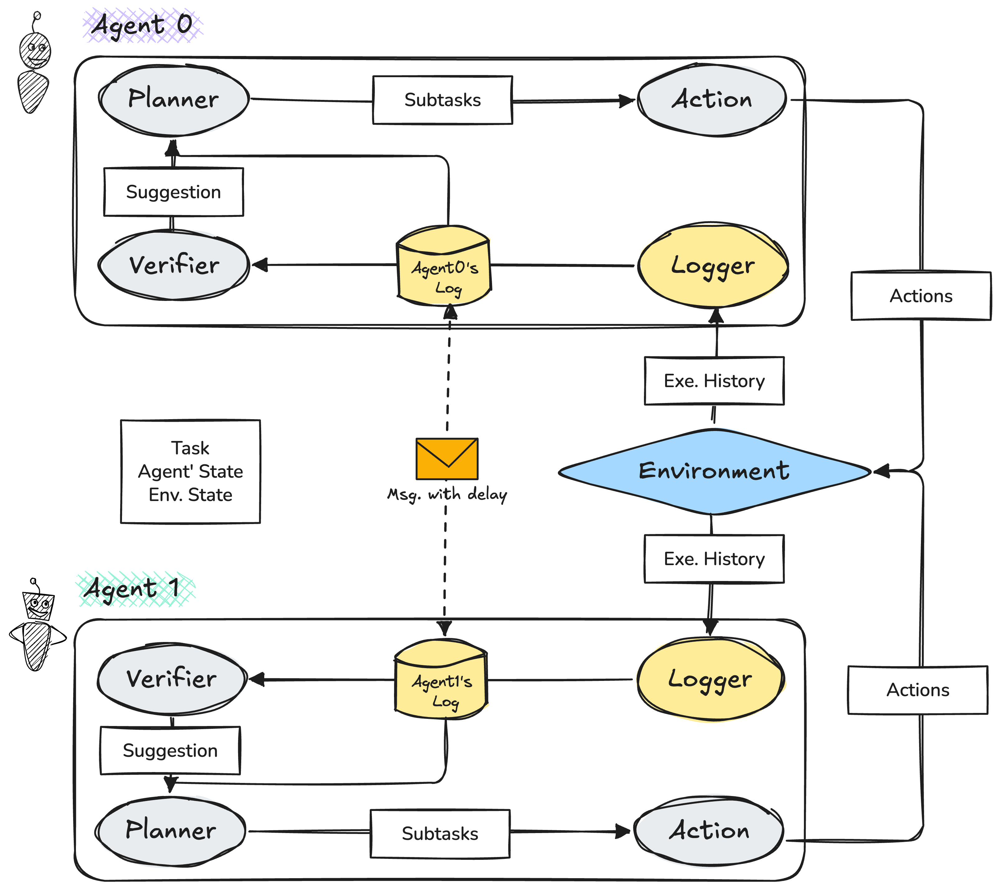

#  LLM Agents for Multi-Robot Task Planning: Centralized and Decentralized Systems

*Jamie Lai*

(Title TBD)

This project investigates centralized and decentralized LLM-driven task planning architectures for multi-robot coordination in AI2-THOR. Using agentic LLMs, the system performs subtask decomposition, action generation, inter-agent communication, and reactive replanning for long-horizon embodied tasks. The project compares how centralized and decentralized planners differ in coordination efficiency, robustness, and agent autonomy. In addition, it evaluates summary-based versus log-based state representations to study LLM forgetting, information retention, and stability across multi-step control. The goal is to better understand how LLM agents can support scalable, reliable multi-robot reasoning in complex simulated environments.

## System Overview

### Centralized Architecture  


### Decentralized Architecture  



## Setup

### Env
I ran on conda environment with python=3.10.
Other dependecies are shown in `requirements.txt`

### LLM API key
- log file path: `logs/{task_name}`
- LLM api key file: `api_ley.txt` in root folder. 
- You can get an api key on [OpenAI Website](https://platform.openai.com/api-keys). The *gpt-4.1* model is used for all experiments.

## Test
- config file path: `config/config.json`
- Before testing, change the content in config file
```python 
{   
    # change these value
    "num_agents": 2,
    "scene": "FloorPlan201", 
    "task": "put remote control, keys, and watch in the box",
    "model": "gpt-4.1-2025-04-14" # choose from gpt models
    "task_folder": "1_put_remotecontrol_keys_watch_box" # Tasks/{task_folder} for checker and scene_init
}
```
> **Configuration Options Reference**  
>  
> `num_agents`: Integer between **1** and **7**  
>  
> `scene`: Format `"FloorPlanX"`  
> Categories (Same as defined in AI2Thor):  
> - Kitchen: `FloorPlan1` to `FloorPlan30`  
> - Living Room: `FloorPlan201` to `FloorPlan230`  
> - Bedroom: `FloorPlan301` to `FloorPlan330`  
> - Bathroom: `FloorPlan401` to `FloorPlan430`  
>  
> `task`: High-level natural language instruction combining actions like:  
> - Put [object] in/on [location]` 
> - Slice [object]` 
> - Clean [object]  
> - Turn on/off [appliance]
> Refer to `config/scene_objects.json` to check which objects are included in each floorplan.  


### Centralized Architecture with summary
For testing, change the content in config file and run:

```python
python env/llm_cm.py
```
### Centralized Architecture with log
For testing, change the content in config file and run:

```python
python env/llm_log3.py
```
### Decentralized Architecture with log
For testing, change the content in config file and run:

```python
python env/llm_dec.py
```


<!-- # MS project
Aiming to implement a decentralized, LLM-driven multi-robot task planning and coordination system that is tolerant of unexpected events during execution.


## Setup

### Env
I ran on conda environment with python=3.10.
Other dependecies are shown in `requirements.txt`

### Test
- config file path: `config/config.json`
- log file path: `logs/{task_name}`
- LLM api key file: `api_ley.txt` in root folder

- test env:
```python
python env/test_env_b.py
```
- When testing, change the content in config file
```python 
{   
    # change these value
    "num_agents": 2,
    "scene": "FloorPlan201", 
    "task": "put remote control, keys, and watch in the box",
    "model": "gpt-4.1-2025-04-14" # choose from gpt models
    "task_folder": "1_put_remotecontrol_keys_watch_box" # Tasks/{task_folder} for checker and scene_init
}
```
> **Configuration Options Reference**  
>  
> `num_agents`: Integer between **1** and **7**  
>  
> `scene`: Format `"FloorPlanX"`  
> Categories (Same as defined in AI2Thor):  
> - Kitchen: `FloorPlan1` to `FloorPlan30`  
> - Living Room: `FloorPlan201` to `FloorPlan230`  
> - Bedroom: `FloorPlan301` to `FloorPlan330`  
> - Bathroom: `FloorPlan401` to `FloorPlan430`  
>  
> `task`: High-level natural language instruction combining actions like:  
> - Put [object] in/on [location]` 
> - Slice [object]` 
> - Clean [object]  
> - Turn on/off [appliance]
> Refer to `config/scene_objects.json` to check which objects are included in each floorplan.  
>  
> `model`: Supported GPT models include:  
> - `"gpt-4o"`  
> - `"gpt-4o-mini"` 
> - `"gpt-4.1-2025-04-14"`  
> 
> Different models may yield different results.
> 
>

### LLM
#### One-time planning with Centralized LLM
>
> Given a high-level task:
> 1. **planner**: generate a list of subtasks to be completed by the robots
> 2. **editor**: edit the generated subtasks to ensure they are  feasible and do not conflict with each other.
> 3. **action planner**: generate a list of actions for each robot to complete the subtasks.
> 4. execute the actions generated by the action planner.


and run:
```python
python env/llm.py
```

#### Centralized LLM + replanning
> 1. **Initial Planning**  
>    Remain the same as previous method: given task, let planner and editor generate a list of subtasks (this will be the open subtasks).
>
> 2. **Iterative Execution Loop** (until timeout or all open subtasks are completed)
>     1. Update open subtasks and completed subtasks.
>     2. Allocate subtasks to robot agents in the environment using LLM.
>     3. Break down each assigned subtask with LLM into a list of smaller available actions.
>     4. Execute one subtask per agent.
>     5. Verify if the subtask is completed using two methods:
>         - LLM-based verification (by observation of the environment)
>         - Rule-based verification
>     6. Replan: Similar to initial planning. Given the task and closed subtasks, let planner and editor generate a new list of subtasks (this will be the new open subtasks).

For testing, change the content in config file and  run:
```python
python env/llm_c.py
```

### Centralized LLM + shared memory/Log

> structure same as llm_ca.py
> 1. initial planning (remain the same as previous method: given task, let planner and editor to generate a list of subtasks (this will be the open subtasks)
> 2. start a loop, until timeout or all the open subtasks is empty:
> 2.1 update open subtasks and completed subtask
> 2.2 allocate subtask to robot agents in the environment with llm
> 2.3 break down each assigned subtasks with llm into a list of smaller available actions
> 2.4 execute one subtask per agents
> 2.5 verify if the subtask is completed and identify the failure reason and collect the history and suggest the next step
> 2.6 replan: similar to initial planning : given task and closed subtask

For testing, change the content in config file and  run:
```python
python env/llm_cm.py

python env/llm_log3.py
```


### Decentralized LLM for multi-agent task planning and execution
(TBD)
> 1. (LLM)planning subtasks for each agent (run initial_subtask_planning per agent) → run once at the beginning  
>
>    *LOOP* (until all subtasks are done or timeout):
>
>    2. (LLM)decompose subtask to smaller actions (decompose_subtask_to_actions per agent)
>
>    3. combine each agent's subtasks into  
>       subtasks: {agent_id: (subtask, [actions(NavigateToObject, PickupObject, ...)]) , ... }
>
>    4. execution (stepwise_action_loop per agent)  
>       while maintaining separate logs with message queue for delayed messaging.
>
>    4.5. (LLM)Log summariser (log_summariser per agent):  
>         decide what to log for each agent (triggered when subtask succeeds/fails or delayed message arrives)
>
>    5. (LLM)verify and replan if needed  
>       (verify_actions, replan_open_subtasks independently per agent)

For testing, change the content in config file and  run:
```python
python env/llm_decen.py
``` -->